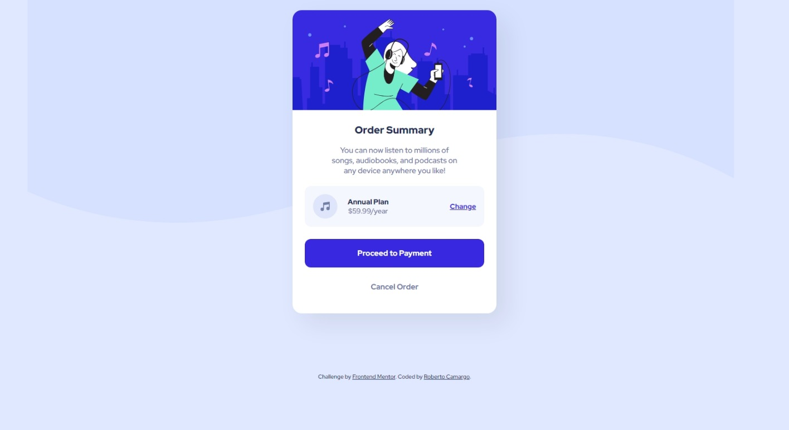

# 🚀 **Frontend Mentor - Order summary card solution**

This is a solution to the [Order summary card challenge on Frontend Mentor](https://www.frontendmentor.io/challenges/order-summary-component-QlPmajDUj). Frontend Mentor challenges help you improve your coding skills by building realistic projects.

## **Table of contents**

- [🚀 **Frontend Mentor - Order summary card solution**](#-frontend-mentor---order-summary-card-solution)
  - [**Table of contents**](#table-of-contents)
  - [📋 **Overview**](#-overview)
    - [🎯 **The challenge**](#-the-challenge)
    - [🖥️ **Screenshot**](#️-screenshot)
    - [🔗 **Links**](#-links)
  - [💡 **My process**](#-my-process)
    - [🛠️ **Built with**](#️-built-with)
    - [📚 **Useful resources**](#-useful-resources)
  - [✍️ **Author**](#️-author)

## 📋 **Overview**

### 🎯 **The challenge**

Users should be able to:

- See hover states for interactive elements

### 🖥️ **Screenshot**

### 🔗 **Links**

- **Solution URL:** [https://www.frontendmentor.io/solutions/order-summary-component-resolution-IIWgVkvGTn](https://www.frontendmentor.io/solutions/order-summary-component-resolution-IIWgVkvGTn)
- **Live Site URL:** [https://lajuro.github.io/order-summary-component/](https://lajuro.github.io/order-summary-component/)

## 💡 **My process**

### 🛠️ **Built with**

- Semantic HTML5 markup
- CSS custom properties
- Flexbox
- Mobile-first workflow

### 📚 **Useful resources**

- [Flexbox](https://css-tricks.com/snippets/css/a-guide-to-flexbox/) - This helped me remember some subjects about flexbox.

## ✍️ **Author**

- Frontend Mentor - [@Lajuro](https://www.frontendmentor.io/profile/Lajuro)
- GitHub - [@Lajuro](https://github.com/Lajuro)
